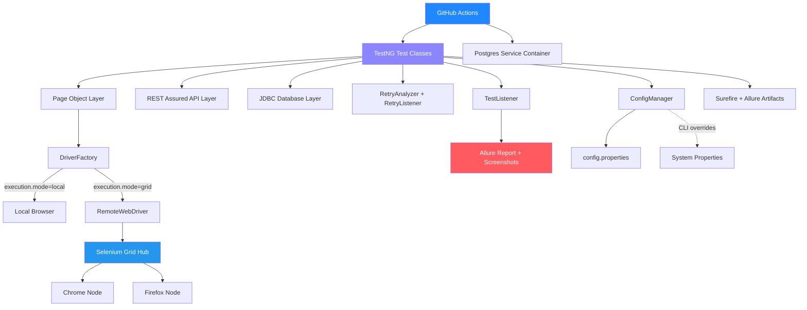

<div align="center">
# 🧪 NexusQA
 
### Enterprise-Grade Test Automation Framework
 

<br/>


 
<br/><br/>
 
*A production-style QA automation framework covering UI, REST API, and PostgreSQL database testing — built from the ground up with resilience engineering, containerized parallel execution, and automated CI/CD reporting.*
 
<br/>
[Features](#-key-features) • [Architecture](#-architecture) • [Getting Started](#-getting-started) • [Running Tests](#-running-tests) • [Reporting](#-reporting) • [CI/CD](#-cicd-pipeline) • [About](#-about-the-author)
 
</div>
<br/>
---
 
## 📌 Overview
 
**NexusQA** is a full-stack test automation framework built to mirror how QA is actually done at a real engineering organization — not a toy Selenium script, but a layered system covering **UI automation, REST API validation, database-level assertions, resilience engineering, containerized execution, and automated CI/CD reporting.**
 
Every design decision in this framework — the Page Object Model, the retry strategy, the fallback locators, the CI pipeline — was made deliberately, and each is documented and defensible in an interview setting. This isn't code copied from a tutorial; it's a framework built milestone by milestone, with real debugging, real environment failures, and real fixes along the way.
 
<br/>
## ✨ Key Features
 
<table>
<tr>
<td width="50%" valign="top">
### 🖱️ UI Automation
- Page Object Model architecture
- Thread-safe `DriverFactory` (parallel-execution ready)
- Cross-browser support: Chrome, Firefox, Edge
- Handles alerts, iframes, drag-and-drop, multi-window flows
- Data-driven testing via Excel (Apache POI)
### 🔌 API Testing
- REST Assured-based API test layer
- Positive and negative auth scenarios
- Response schema and status code validation
</td>
<td width="50%" valign="top">
### 🗄️ Database Validation
- PostgreSQL + JDBC integration
- `PreparedStatement`-based queries (SQL-injection-safe by design)
- Cross-layer validation: UI actions verified directly against DB state
### 🛡️ Resilience Engineering
- Bounded automatic retry (max 2 attempts, fully logged — not silent)
- Fallback-locator strategy for brittle selectors
- Global retry registration via TestNG `ServiceLoader`, zero per-test boilerplate
</td>
</tr>
<tr>
<td width="50%" valign="top">
### 🐳 Containerized Execution
- Dockerized Selenium Grid (Hub + Chrome/Firefox nodes)
- Local vs. Grid execution switch via config
- Built for horizontal, parallel test execution
</td>
<td width="50%" valign="top">
### 🔁 CI/CD Pipeline
- GitHub Actions — runs on every push and PR
- Ephemeral PostgreSQL service container in CI
- Headless execution on cloud runners
- Auto-uploaded Surefire + Allure artifacts
</td>
</tr>
<tr>
<td width="50%" valign="top">
### 📊 Rich Reporting
- Allure dashboard: step-by-step execution timeline
- Automatic screenshot-on-failure attachment
- Historical trend and category breakdowns
</td>
<td width="50%" valign="top">
### 🔐 Secure by Design
- Zero hardcoded credentials in source
- Config-driven, environment-overridable secrets
- `.gitignore`-enforced separation of local vs. shared config
</td>
</tr>
</table>
<br/>
## 🏗️ Architecture
 

 
<br/>
## 🧰 Tech Stack
 
<div align="center">

</div>
<table>
<tr><td><b>Language</b></td><td>Java 17</td></tr>
<tr><td><b>Build Tool</b></td><td>Apache Maven</td></tr>
<tr><td><b>UI Automation</b></td><td>Selenium WebDriver 4.27, WebDriverManager</td></tr>
<tr><td><b>Test Framework</b></td><td>TestNG 7.8</td></tr>
<tr><td><b>API Testing</b></td><td>REST Assured 5.5</td></tr>
<tr><td><b>Database</b></td><td>PostgreSQL 16, JDBC</td></tr>
<tr><td><b>Data-Driven Testing</b></td><td>Apache POI (Excel)</td></tr>
<tr><td><b>Containerization</b></td><td>Docker, Docker Compose, Selenium Grid 4.24</td></tr>
<tr><td><b>CI/CD</b></td><td>GitHub Actions</td></tr>
<tr><td><b>Reporting</b></td><td>Allure 2.29</td></tr>
<tr><td><b>Logging</b></td><td>Log4j 2.24</td></tr>
<tr><td><b>Serialization</b></td><td>Jackson Databind</td></tr>
</table>
<br/>
## 📁 Project Structure
 
```
NexusQA/
├── .github/workflows/
│   └── ci.yml                      # GitHub Actions pipeline
├── src/
│   ├── main/java/com/akash/nexusqa/
│   │   ├── config/                 # ConfigManager — CLI-override-aware
│   │   ├── core/                   # DriverFactory (local + grid modes)
│   │   ├── db/                     # DBUtils — JDBC, PreparedStatements
│   │   ├── exceptions/             # Custom exception types
│   │   ├── listeners/              # RetryAnalyzer, RetryListener, TestListener
│   │   ├── pages/                  # Page Object Model classes
│   │   └── utils/                  # ExcelReader, ScreenshotUtils
│   └── test/
│       ├── java/com/akash/nexusqa/tests/
│       │   ├── ui/                 # UI test classes
│       │   ├── api/                # API test classes
│       │   └── db/                 # Database validation tests
│       └── resources/
│           ├── config/config.properties
│           ├── testdata/loginData.xlsx
│           ├── allure.properties
│           └── META-INF/services/org.testng.ITestNGListener
├── docker-compose.yml              # Selenium Grid (hub + chrome + firefox nodes)
├── KNOWN_LIMITATIONS.md
├── INTERVIEW_PREP.md
└── pom.xml
```
 
<br/>
## 🚀 Getting Started
 
### Prerequisites
- Java 17 (JDK)
- Apache Maven
- PostgreSQL 16 (local, or via Docker)
- Docker Desktop (optional — required only for Grid execution)
- Chrome / Firefox installed locally
### Installation
 
```bash
git clone https://github.com/akashsb2005/NexusQA.git
cd NexusQA
mvn clean install -DskipTests
```
 
### Configuration
 
Update `src/test/resources/config/config.properties`:
 
```properties
browser=chrome
headless=false
baseUrl=https://www.saucedemo.com
execution.mode=local
grid.url=http://localhost:4444/wd/hub
dbUrl=jdbc:postgresql://localhost:5432/nexusqa
dbUsername=postgres
dbPassword=CHANGE_ME_LOCALLY
```
 
> ⚠️ Never commit real credentials. All sensitive values here are placeholders — override locally or via CLI/CI environment variables.
 
<br/>
## ▶️ Running Tests
 
**Full suite:**
```bash
mvn clean test
```
 
**Specific test class:**
```bash
mvn clean test "-Dtest=LoginTest" "-DfailIfNoTests=false"
```
 
**Headless execution:**
```bash
mvn clean test -Dheadless=true
```
 
**Cross-browser override:**
```bash
mvn clean test -Dbrowser=firefox
```
 
**Against a Dockerized Selenium Grid:**
```bash
docker compose up -d
mvn clean test -Dexecution.mode=grid
```
Watch live sessions at `http://localhost:4444`.
 
<br/>
## 📊 Reporting
 
NexusQA generates an interactive **Allure** dashboard after every run — step-by-step execution breakdowns, automatic screenshot capture on failure, suite trends, and category-based failure grouping.
 
```bash
mvn clean test
mvn allure:serve
```
 
**What you get:**
- ✅ Pass/fail breakdown with 100% history trend
- 🖼️ Auto-attached screenshots on any failure
- 🪜 `@Step`-annotated execution timelines per test
- 📂 Suite, feature, and package-level groupings
<br/>
## 🔁 CI/CD Pipeline
 
Every push and pull request to `main` automatically triggers a full pipeline run on GitHub Actions:
 
1. Fresh Ubuntu VM provisioned
2. Java 17 + Maven set up
3. Ephemeral PostgreSQL service container spun up
4. Full suite run headlessly against Chrome
5. Surefire + Allure results uploaded as downloadable artifacts
6. Pass/fail reported directly as a commit/PR status check
No local environment dependency — the pipeline is fully self-contained and reproducible on any machine.
 
<br/>
## 🧪 Test Coverage Snapshot
 
<table>
<tr><th>Layer</th><th>Scenarios Covered</th></tr>
<tr><td><b>UI</b></td><td>Valid/invalid login, locked-out user, data-driven negative login (Excel), JS alerts, drag-and-drop, iframes, new window handling</td></tr>
<tr><td><b>API</b></td><td>Health check, valid/invalid authentication, user registration and response validation</td></tr>
<tr><td><b>Database</b></td><td>User existence checks, cross-layer UI-to-DB state validation</td></tr>
</table>
<div align="center">
**16 automated tests · 100% passing · fully integrated into CI**
 
</div>
<br/>
## 🗺️ Project Roadmap (15 Milestones)
 
<table>
<tr><td>✅ 1–4</td><td>Framework foundation — Maven setup, config management, driver factory, base page architecture</td></tr>
<tr><td>✅ 5</td><td>Logging &amp; reporting foundation (Log4j)</td></tr>
<tr><td>✅ 6–8</td><td>Core UI test suite — login, negative scenarios, browser interaction edge cases</td></tr>
<tr><td>✅ 9</td><td>REST API testing layer (REST Assured)</td></tr>
<tr><td>✅ 10</td><td>PostgreSQL/JDBC database validation layer</td></tr>
<tr><td>✅ 11</td><td>Retry mechanism + resilient fallback-locator strategy</td></tr>
<tr><td>🟡 12</td><td>Docker + Selenium Grid — implemented in code; local environment verification pending (see <code>KNOWN_LIMITATIONS.md</code>)</td></tr>
<tr><td>✅ 13</td><td>CI/CD pipeline via GitHub Actions</td></tr>
<tr><td>✅ 14</td><td>Allure reporting — step annotations, screenshot-on-failure</td></tr>
<tr><td>✅ 15</td><td>Final polish, cleanup, documentation, interview prep</td></tr>
</table>
<br/>
## ⚠️ Known Limitations
 
Documented transparently in [`KNOWN_LIMITATIONS.md`](./KNOWN_LIMITATIONS.md) — including the current state of local Grid verification, retry configurability, and parallel execution scope. Honest scoping over overclaiming.
 
<br/>
## 💡 Why This Project
 
This framework was built to demonstrate real QA engineering judgment, not just Selenium syntax:
 
- **Layered testing strategy** — UI, API, and DB validated independently and cross-referenced
- **Resilience over brittleness** — bounded retries with visible logging, not silent masking of flaky tests
- **Honest scoping** — fallback locators explicitly *not* oversold as "AI self-healing"
- **Production CI/CD** — a real pipeline, not a local-only demo
- **Debuggable by design** — every failure ships with a screenshot and a step-by-step trace
<br/>
---
 
<br/>
## 👤 About the Author
 
<div align="center">

<br/><br/>
 
<a href="https://www.linkedin.com/in/akash-bagoji-218671332"></a>
<a href="https://www.codechef.com/users/akashsb2005"></a>
<a href="https://leetcode.com/u/akashsb2005/"></a>
<a href="mailto:bagojiakash75@gmail.com"></a>
 
</div>
**Akash Bagoji** is a B.Tech Computer Science (AI & ML) student at PES University, currently an R&D Member at **PI Labs, PESU**, building *Socratic Mirror* — an LLM-powered reflective tutoring platform. He previously worked as a Summer Intern at **BSERC (ISRO)** in Software/AI Engineering, and as an R&D Intern at **Decode Labs** in the generative AI domain.
 
NexusQA reflects the same engineering approach applied across his other projects — **Socratic Mirror**, **DocChat** (a RAG-based document Q&A system), and **VulTriage** (an LLM-powered vulnerability triage tool): build it properly, document it honestly, and be ready to defend every design decision.
 
<div align="center">
<br/>
<i>Open to applied AI/ML, backend, and QA/SDET internship roles — let's talk.</i>
</div>
 
